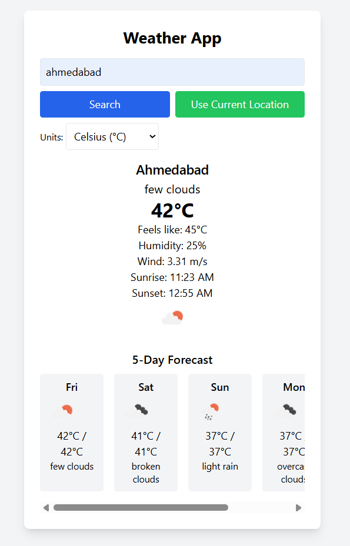

# 🌦️ Weather App

A simple and modern weather web application that displays current weather and 5-day forecast for any city or your current location. Built using **HTML**, **Tailwind CSS**, and **Vanilla JavaScript**, and powered by the **OpenWeatherMap API**.

## 🔥 Features

- 🌍 Search weather by **city name** or **current location**
- 🌡️ Toggle between **Celsius** and **Fahrenheit**
- 📅 View **5-day forecast** with day-wise temperature and conditions
- 🌤️ Displays weather icon, humidity, wind speed, sunrise/sunset, and more
- 💾 Remembers your last selected temperature unit
- 🎯 Fully responsive and mobile-friendly design using Tailwind CSS

## 🛠️ Technologies Used

- HTML5
- Tailwind CSS
- JavaScript (Vanilla)
- OpenWeatherMap API

## 🚀 Getting Started

### 1. Clone the repository

```bash
git clone https://github.com/your-username/weather-app.git
cd weather-app
```

### 2. Open `index.html` in your browser

Just double-click `index.html` or use a live server extension (like in VSCode).

### 3. Add your API Key

Replace the placeholder in the script with your own key:
```js
const apiKey = 'YOUR_API_KEY'; // Get it from https://openweathermap.org/api
```

## 📸 Preview



## 🔧 File Structure

```
weather-app/
├── index.html        # Main application file
├── README.md         # Project documentation
└── screenshot.png    # Optional: Add a screenshot of your app
```

## 💡 Customization

You can easily:

- Change the theme or styles using Tailwind classes
- Add hourly forecast or map integrations
- Enhance UX with loading states or animations

## 📄 License

This project is open-source and available under the [MIT License](LICENSE).

---

## 🤝 Credits

- Weather data provided by [OpenWeatherMap](https://openweathermap.org/)
- UI styled using [Tailwind CSS](https://tailwindcss.com/)

---